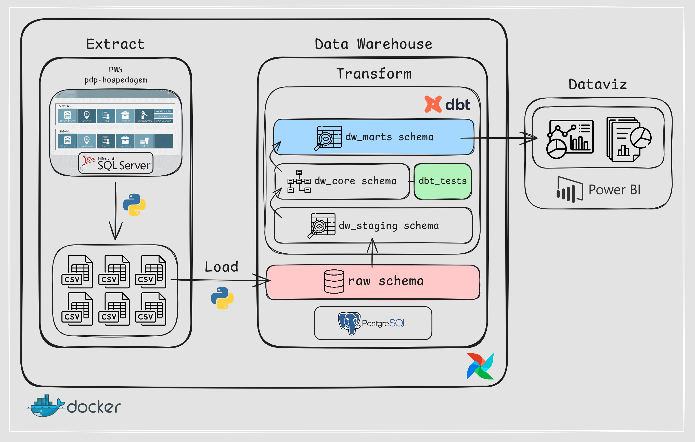
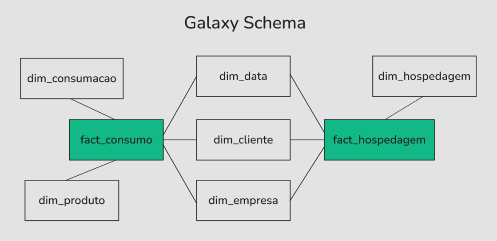
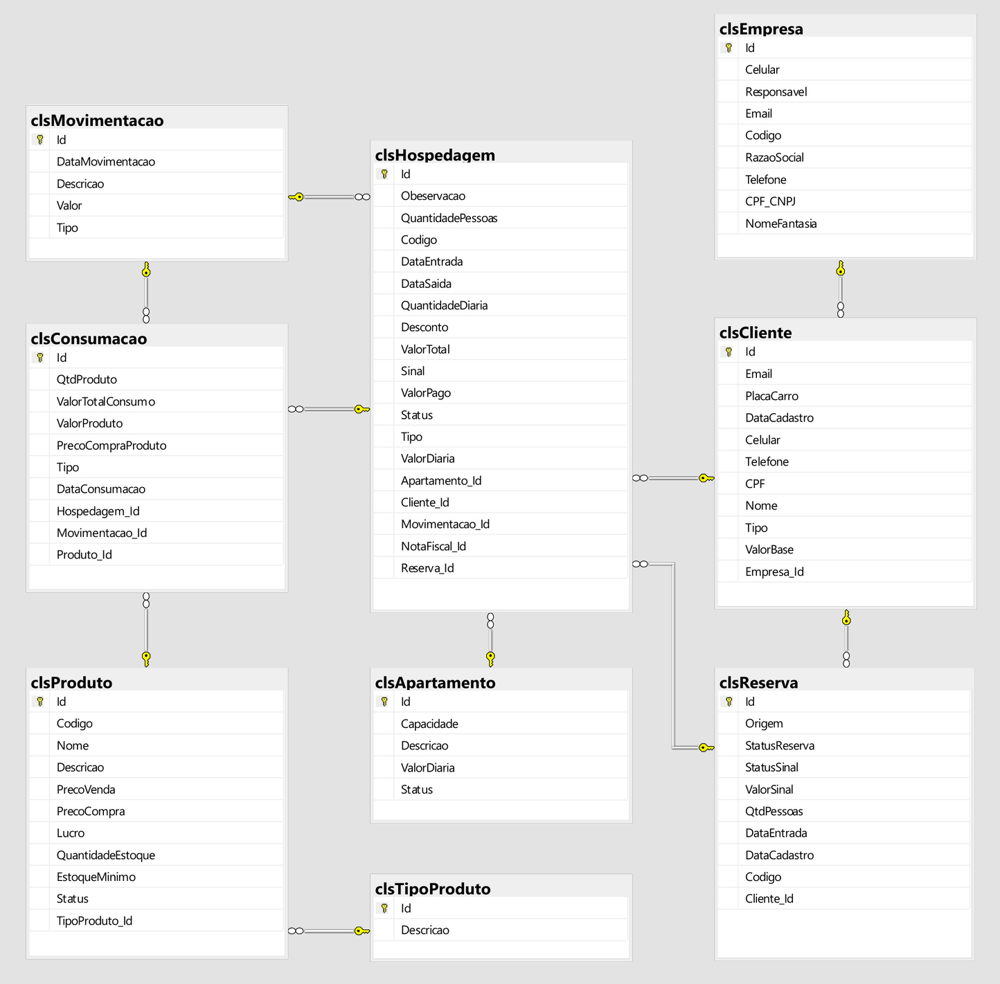

# 🗄️ pdp-dw-powerbi
[](https://github.com/rafa-trindade/pdp-hospedagem)

Este projeto realiza a **implementação, modelagem e consumo de um Data Warehouse** utilizando **Airflow**, **DBT** e **Power BI**, integrando dados transacionais do projeto [pdp-hospedagem](https://github.com/rafa-trindade/pdp-hospedagem).

O projeto contempla:  
- **Conteinerização da aplicação** com **Docker**, garantindo isolamento, portabilidade e facilidade de execução dos serviços (Airflow, PostgreSQL, pgAdmin, DBT);  
- **Orquestração de pipelines** utilizando o **Apache Airflow**;  
- **Transformação, documentação e modelagem** utilizando o **DBT**:
- **Consumo dos modelos analíticos** gerados pelo **DBT** no **Power BI**, garantindo uma **camada de visualização integrada** e **atualizações automatizadas** dos dashboards e relatórios.



---

## 📍 Progresso do Projeto:

- ✅ Criação das dimensões `dim_date` e `dim_time` via Python que serão utilizadas como **seeds** no DBT.  
- ✅ Ingestão de dados transacionais fictícios no banco de dados **SQL Server** do projeto [**pdp-hospedagem**](https://github.com/rafa-trindade/pdp-hospedagem) utilizando [**datafaker-rafatrindade**](https://github.com/rafa-trindade/datafaker-rafatrindade).  
- ✅ **Conteinerização** do projeto utilizando **Docker**, com configuração de:
  - **Dockerfile** para instalar dependências necessárias e preparar o container.
  - **docker-compose.yml** para orquestrar o Airflow e os containers de banco de dados (**SQL Server** e **PostgreSQL** + **pgAdmin**).
- ✅ Implementação da **extração (Extract)** dos dados transacionais via pipeline orquestrada no **Airflow**, com arquivos extraídos salvos na pasta `data/extracted`.  
- ✅ Implementação da **Carga (Load)** dos dados extraídos do SQL Server para a camada **raw** do Data Warehouse (PostgreSQL) via pipeline orquestrada no **Airflow**.  
- ✅ **Transformações (Transform)** e modelagem dos dados no DBT, estruturando as camadas **staging** e **core**.  
- ✅ Implementação de **testes automatizados** via DBT para garantir a **qualidade dos dados** na camada **core**.  

---

## 🚧 Próximos Passos:

- Modelagem de tabelas analíticas a partir das **tabelas fato e dimensão** utilizando o DBT na camada **mart**.  
- Consumo dos modelos analíticos no **Power BI** para criação de dashboards e relaórios.  

---

### 🔁 Resumo da Arquitetura ELT e Dataviz:

1. **Extract:** Extração dos dados transacionais do SQL Server via Airflow. *(Etapa concluída ✅)*  
2. **Load:** Carga dos dados brutos na camada **raw** do Data Warehouse (PostgreSQL) via Airflow. *(Etapa concluída ✅)*
3. **Transform:** Transformações e modelagem realizadas pelo DBT diretamente no Data Warehouse. *(Em andamento 🚧)* 
4. **Dataviz:** Consumo e análise dos dados no **Power BI**, com desenvolvimento de dashboards e relatórios. *(Próxima Etapa 🔜)*  

---

## ⚡ Inicialização do ambiente com Docker:

```bash
docker-compose build
docker-compose up -d
```

## ⚡ Exemplo de execução manual para teste da DAG de extração:

```bash
docker exec -it airflow airflow tasks test elt_dag extract_data 2025-10-24
```

## ⚡ Exemplo de execução manual para teste da DAG de carga:

```bash
docker exec -it airflow airflow tasks test elt_dag load_data 2025-10-24
```

---

## 📦 Bibliotecas Utilizadas:

**Ambiente:** Python 3.11 + Airflow 2.9.3

| Pacote            | Versão      | Observação |
|-------------------|------------|------------|
| **pandas**        | 2.3.3      | Manipulação e transformação de dados |
| **requests**      | 2.32.3     | Requisições HTTP e integração de APIs |
| **python-dotenv** | 1.0.1      | Carregamento de variáveis de ambiente do arquivo `.env` |
| **dbt-core**      | 1.10.13    | Transformações e modelagem no Data Warehouse |
| **dbt-postgres**  | 1.9.1      | Adaptador DBT para PostgreSQL |
| **SQLAlchemy**    | 2.0.22     | ORM e conexão com bancos de dados |
| **psycopg2-binary** | 2.9.7   | Driver PostgreSQL para Python |
| **pyodbc**        | 5.3.0      | Driver ODBC para conexão com diversos bancos |
| **msodbcsql17** | Microsoft (APT) | Driver oficial ODBC do SQL Server para Linux |

---

## 🗂️ Estrutura do Projeto:

```text
pdp-dw-powerbi/
├── airflow/                 # Orquestração de pipelines ETL/ELT com Airflow
│   ├── dags/                # Definição dos DAGs
│   ├── logs/                # Armazenamento de logs de execução dos DAGs
│   └── plugins/             # Plugins customizados do Airflow
├── config/                  # Arquivos de configuração do projeto
├── data/                    # Dados brutos e processados
│   ├── extracted/           # Dados extraídos das fontes
├── dbt/                     # Projeto DBT
│   ├── models/              
│   │   ├── staging/         # Modelos staging (limpeza e padronização de dados)
│   │   ├── core/            # Modelos core (dados integrados e limpos)
│   │   └── marts/           # Modelos marts (tabelas para análise e dashboards)
│   ├── seeds/               # Seeds (ex.: dim_date)
│   ├── tests/               # Testes de qualidade do DBT
│   ├── dbt_project.yml      # Configuração do projeto DBT
│   └── profiles.yml         # Configuração de conexão com o banco
├── docs/                    # Documentação do projeto
│   ├── diagrams/            # Diagramas de bancos OLTP e DWH
│   ├── powerbi_screenshots/ # Capturas de tela de dashboards
│   └── data_dictionary.md   # Dicionário de dados
├── reports/                 # Relatórios Power BI exportados
├── scripts/                 # Pipelines ETL e scripts auxiliares (ex.: geração de seeds via Python)
├── .env                     # Variáveis de ambiente do projeto
├── docker-compose.yml       # Configuração para execução de containers Docker
├── Dockerfile               # Definições da imagem Docker do projeto
├── main.py                  # Script para execução local
├── README.md                # Documentação do projeto
└── requirements.txt         # Dependências Python
```

---

## 🧠 Diagrama do Modelo OLAP:


## 🧩 Diagrama do Modelo OLTP:


